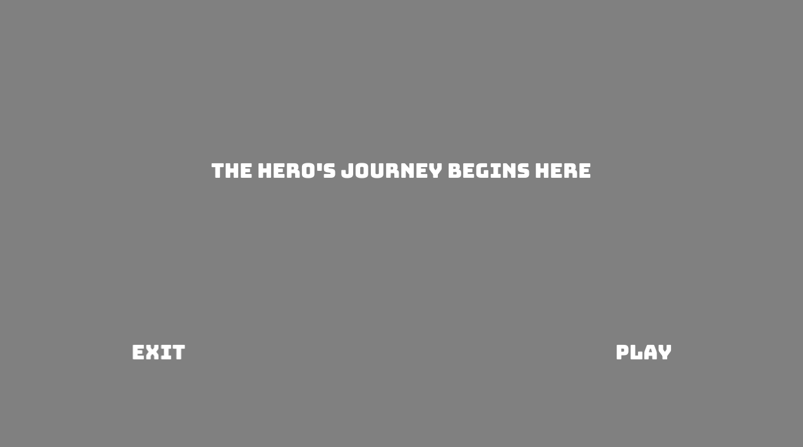

# Treasure hunt

## Author: Gustavo Silvera

## Design: 
This text adventure game is a treasure hunt style discrete decision-based game where your goal (as the wandering explorer) is to escape the cave with the maximum (2) amount of treasure. What is interesting is that along the way you might find special items that you can only pick up one of, so choose wisely! Your inventory might mean the difference between life and death!

## Text Drawing: 
The text rendering is accomplished on a per-codepoint (char) basis, where each requested codepoint is lazily computed into a texture using the `Character::Load(hb_codepoint_t request, FT_Face typeface)` function in [`Text.hpp`](Text.hpp). For a particular string, every character is parsed and the corresponding `glTexture` is created. Note that this script (logic in `struct Text`) caches the results of `Character::Load` so future codepoints that were previously rendered can save on performance. One by one the characters (codepoints) are rendered and stored into the corresponding `TextureID` pointing to the `glTexture` that gets drawn with `glDrawArrays`. Additionally, the number of characters rendered depends on the `Text`'s `time` parameter which defines the animation state to get the *typing* effect you see on screen. 

## Choices: 
The choices in this choice-based text adventure are authored from a narrators perspective and provide options to change player state (such as an inventory system). This makes some game paths only possible with the right combination of inventory/choice options. 

## Screen Shot:

## How To Play:

- Use the left/right arrows to change the selection between the two options (left/right). 
- Use the enter key to select an option once it is highlighted

## Sources:
- Font: [`BungeeSpice-Regular.ttf`](dist/BungeeSpice-Regular.ttf) from [https://fonts.google.com/specimen/Bungee+Spice](https://fonts.google.com/specimen/Bungee+Spice)
- OpenGL help: [https://learnopengl.com/In-Practice/Text-Rendering](https://learnopengl.com/In-Practice/Text-Rendering)
- Vertex shader help: [https://learnopengl.com/code_viewer_gh.php?code=src/7.in_practice/2.text_rendering/text.vs](https://learnopengl.com/code_viewer_gh.php?code=src/7.in_practice/2.text_rendering/text.vs)
- Fragment shader help: [https://learnopengl.com/code_viewer_gh.php?code=src/7.in_practice/2.text_rendering/text.fs](https://learnopengl.com/code_viewer_gh.php?code=src/7.in_practice/2.text_rendering/text.fs)
- Harfbuzz/Freetype help: [https://github.com/harfbuzz/harfbuzz-tutorial/blob/master/hello-harfbuzz-freetype.c](https://github.com/harfbuzz/harfbuzz-tutorial/blob/master/hello-harfbuzz-freetype.c)

## Hints:
- You will want to pick up the rope (need a sword) and medicine, fall down the well and heal to grab the first treasure, climb back up with the rope, act peaceful with the goblins, and climb the tree to get the maximum amount (2) of treasure!

This game was built with [NEST](NEST.md).

